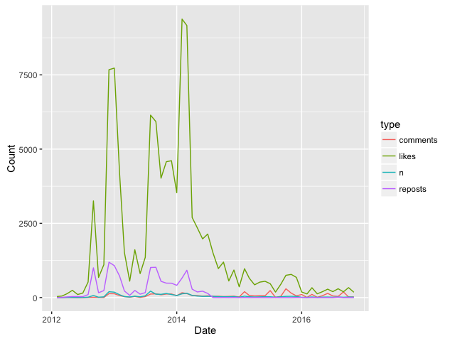

[](https://travis-ci.org/Dementiy/vkR)

`vkR` is an R package which provides access to the [VKontakte](https://vk.com/) (VK) API.

## Installation

``` r
install.packages("devtools")
devtools::install_github("Dementiy/vkR")
library("vkR")
```

## Authorization

Most API requests require the use of an access token. VK has several types of authorization mechanisms. Check out the [documentation](https://vk.com/dev/authentication) for more details.

``` r
vkOAuth(CLIENT_ID, 'SCOPE', 'EMAIL', 'PASSWORD')
```

where:
* `CLIENT_ID` - is an application ID. You have to create new [Standalone-app](https://vk.com/dev/standalone) in VK to get ID (or use the already existing).
* `SCOPE` - the list of comma separated access rights, e.g. `'friends,groups'`- provide the access to user friends and groups. List of all rights can be found [here](https://vk.com/dev/permissions).
* `EMAIL` and `PASSWORD` - username and password.

If the `EMAIL` and `PASSWORD` have been omitted, a browser window will be opened. In the address bar an access token will be shown. Access token must be copied and passed as an argument into the following function:

``` r
setAccessToken(access_token = 'YOUR ACCESS TOKEN')
```

## Example of use

Building a Friend Graph:

``` r
my_friends <- getFriends(fields = 'sex')
my_friends <- filter(my_friends$items, is.na(deactivated))
network <- getNetwork(my_friends$id)

library("igraph")
g <- graph.adjacency(as.matrix(network), weighted = T, mode = "undirected")
layout <- layout.fruchterman.reingold(g)
plot(g, layout = layout)
```

Analyzing community activity:
``` r
domain <- 'nipponkoku'
wall <- getWallExecute(domain = domain, count = 0, progress_bar = TRUE)
metrics <- jsonlite::flatten(wall$posts[c("date", "likes", "comments", "reposts")])
metrics$date <- as.POSIXct(metrics$date, origin="1970-01-01", tz='Europe/Moscow')

library(dplyr)
df <- metrics %>% 
  mutate(period = as.Date(cut(date, breaks='month'))) %>% 
  group_by(period) %>%
  summarise(likes = sum(likes.count), comments = sum(comments.count), reposts = sum(reposts.count), n = n())

library(ggplot2)
library(tidyr)
ggplot(data=gather(df, 'type', 'count', 2:5), aes(period, count)) + geom_line(aes(colour=type)) +
  labs(x='Date', y='Count')
```

<center></center>

You can find more examples in `examples` directory.
